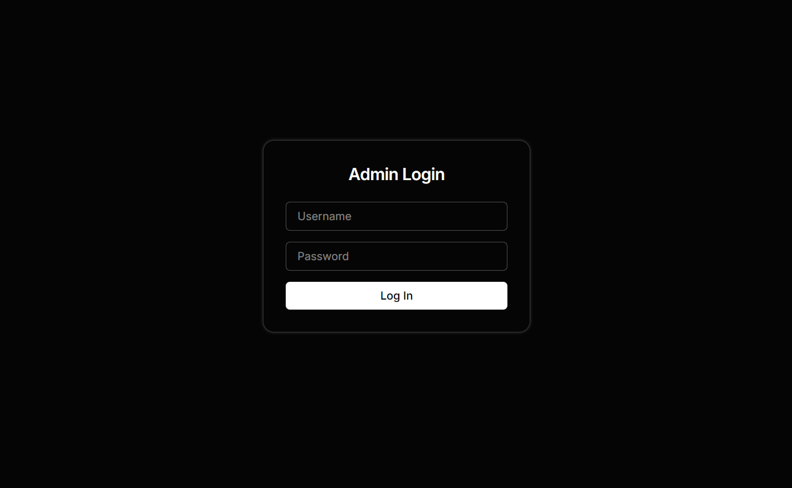

<h1>Nexable</h1>
Next.js site with client-side editable content.  

## Getting Started

1. Clone the repo
2. Create a local env file with your API keys `.env.local`
3. Install the project's dependencies `npm install`
4. Run the dev server `npm run dev`

Your site will be running at <http://localhost:3000>

## Tech Stack

- Next.js v15 app router
- Tailwind v3
- Neon db
- Vercel Blob
